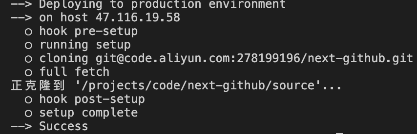
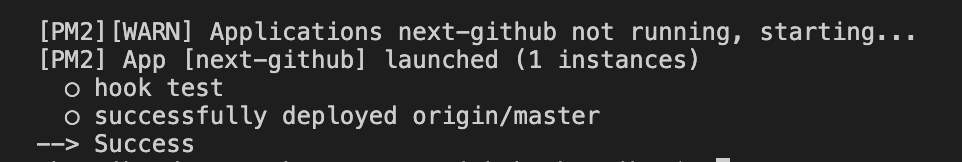
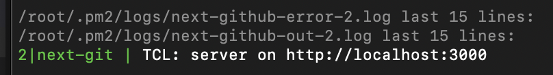

# PM2实现自动化部署

## 前置准备

1. 实现ssh免密登录服务器
2. 实现免密拉取远程仓库代码
3. 服务器安装git,nodejs,pm2环境

## 配置pm2

1. 在本地项目根目录执行`pm2 ecosystem`指令生成部署模板`ecosystem.config.js`，具体内容如下

```js
module.exports = {
  apps : [{
    name: 'next-github',
    script: 'server.js',
    instances: 1,
    autorestart: true,
    watch: false,
    max_memory_restart: '1G',
    env: {
      COMMON_VARIABLE: true
    },
    env_production: {
      NODE_ENV: 'production'
    }
  }],

  deploy : {
    production : {
      user : 'root', // 服务器的用户名
      host : '47.xx.xx.xx', // 服务器的ip地址
      port: 22, // ssh端口
      ref  : 'origin/master', // 要拉取的git分支
      repo : 'git@xxxx.com:xxx/next-github.git', // 远程仓库地址
      ssh_options: 'StrictHostKeyChecking=no', // SSH 公钥检查
      path : '/projects/code/next-github', // 拉取到服务器某个目录下
      'post-deploy' : 'npm install && npx next build && pm2 reload ecosystem.config.js --env production',
      'env': {
        NODE_ENV: 'production'
      }
    }
  }
}
```

2. 提交代码到远程仓库

3. 本地执行`pm2 deploy ecosystem.config.js production setup`(该步骤不会执行`post-deploy`里的命令),完成后服务器目录(之前`path`里写的路径)下会多出三个文件夹，分别是`current,shared和source`(项目代码放在这个，此时的文件夹里还不含`node_modules`目录)。成功后本地控制台打印如下图所示


4. 本地执行`pm2 deploy ecosystem.config.js production`, 此时`source`文件夹下会多出一个`node_modules`目录，部署成功后，本地控制台打印如下图所示


5. 服务端执行`pm2 logs`查看服务是否正确启动，如果成功启动，则服务器控制台结果如下图

