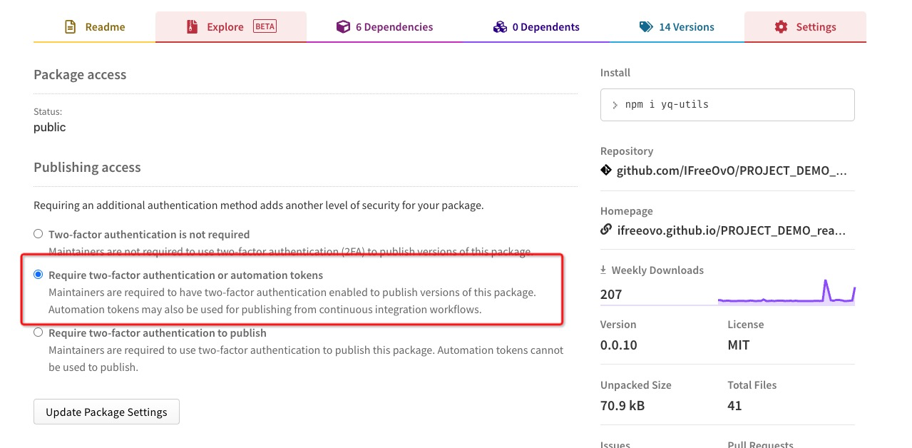
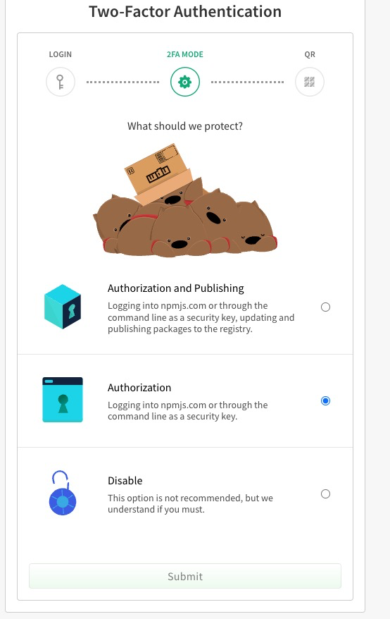
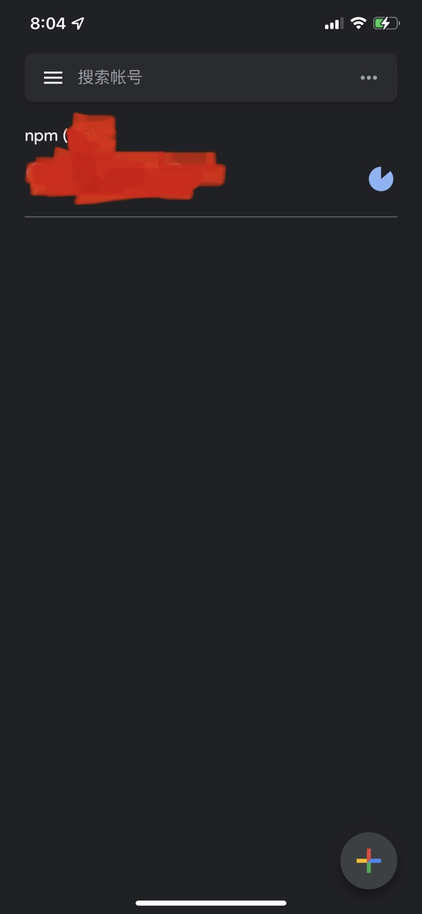
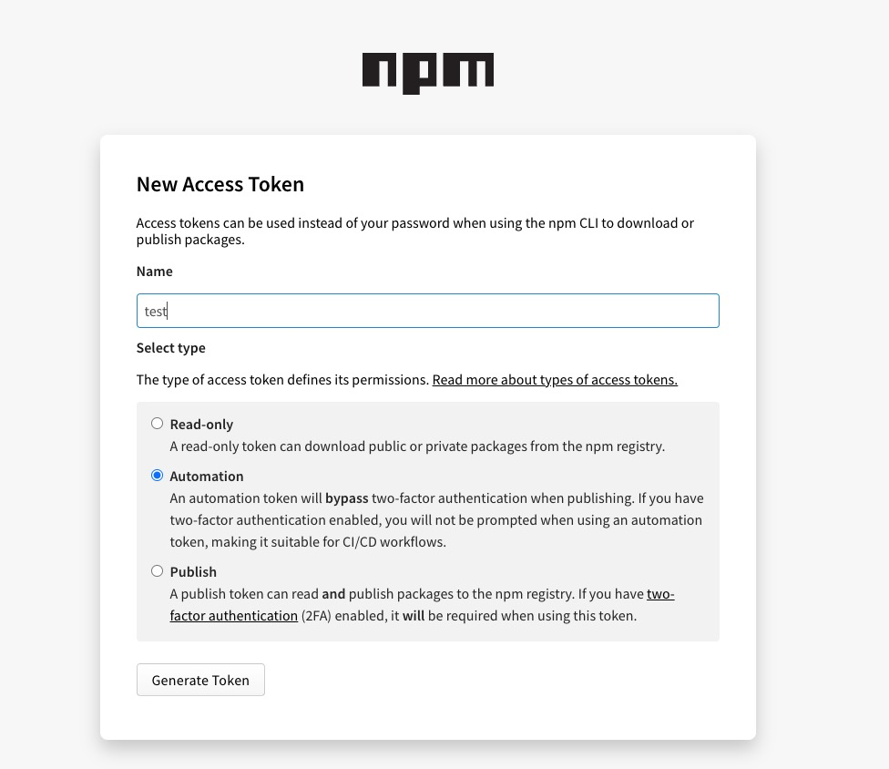

# 使用token发布npm包

## 使用场景

在CI/CD自动化发布npm场景中，网上大部分文章采用的是`npm cli`命令方式输入账号密码，或者在`.npmrc`内置好账号密码，然后执行`npm publish`。这种方法可行，
但是不太安全，存在泄露账号的风险。所以本文讲述的是如何通过`token`这种安全的方式实现发包。

## 配置步骤

1. 打开npm官网进行登录，进入你所要发布的那个包的详情界面，打开包的`settings`设置界面(需要再次输入密码)，选择`Require two-factor authentication or automation tokens`，然后点击`update package settings`按钮保存设置


2.此时系统会询问是否要开启2FA(Two Factor Authentication)登录(已经开启2FA的用户不会出现这个界面)，同意开启，2FA模式选择`Authorization`，然后点击提交


3.此时，界面会提示你，需要手机扫码，然后在输入框输入OTP码。我们可以在手机上下载`authenticator`这个app，然后用这个app进行扫码，之后app会生成一个OTP码。把这个码输入到刚才界面上的输入框里，再点击提交按钮开启2FA功能(开启成功后界面会出现几行字符串让你手动保存，这里就不截图了)。


4.接下来，在npm官网右上角点击自己的用户头像，选择`Access Tokens`，再点击`Generate New Token`按钮生成token(需要再次输入密码)。
然后创建`Automation`类型的token，token名称随意写，点击生成token。界面会返回一个token给你，记得手动保存一下token(因为离开界面后就再也看不到完整的token，需要重新生成)


5.完成上述步骤后，打开我们要发的包的代码库，在项目根目录创建`.npmrc`文件，写入以下代码：

```
registry=https://registry.npmjs.org/
//registry.npmjs.org/:always-auth=true
//registry.npmjs.org/:_authToken=xxxx // xxxx代表刚才我们生成的token
```

6.至此我们已完成了使用`token`发包的所有步骤。使用`npm logout`退出登录测试一下发布，然后输入`npm publish`，此时无需登录账号密码也能发布npm包(还省去了输入OTP码的麻烦)。以后发布包时只需要`npm publish`一条命令即可

## 扩展：其他登录npm方式

#### 1.auth方式

1.首先生成auth。它是由'`账号:密码`'这种格式的字符串进行base64加密得到的。mac用户可以在控制台输入`echo -n 'myuser:mypassword' | openssl base64`直接生成得到(记得用自己的账号密码替换`myuser`和`mypassword`部分)。windows用户可以在网上找个base64加密工具进行生成

2.第二步在项目根目录手动创建`.npmrc`文件

3.最后，在`.npmrc`进行如下配置

```
registry=https://registry.npmjs.org/  // 设置镜像源
# @test:registry=http://npm.test.net // @test开头的包发布到私有镜像源。如果有需要可以加上这句
_auth=xxxxxxx // 用第一步生成的auth
```

#### 2.账号密码方式

1.先在项目根目录手动创建`.npmrc`文件

2.在`.npmrc`进行如下配置

```
registry=https://registry.npmjs.org/
//registry.npmjs.org/:always-auth=true
//registry.npmjs.org/:username=xxxx  // xxxx代表用户名
//registry.npmjs.org/:password=xxxx // xxxx代表base64加密后密码
```
