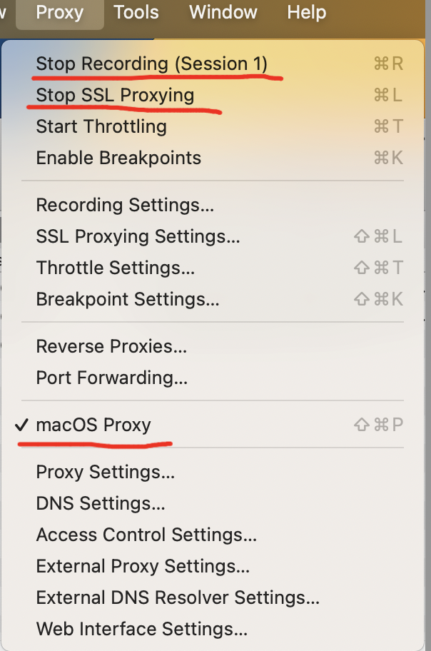
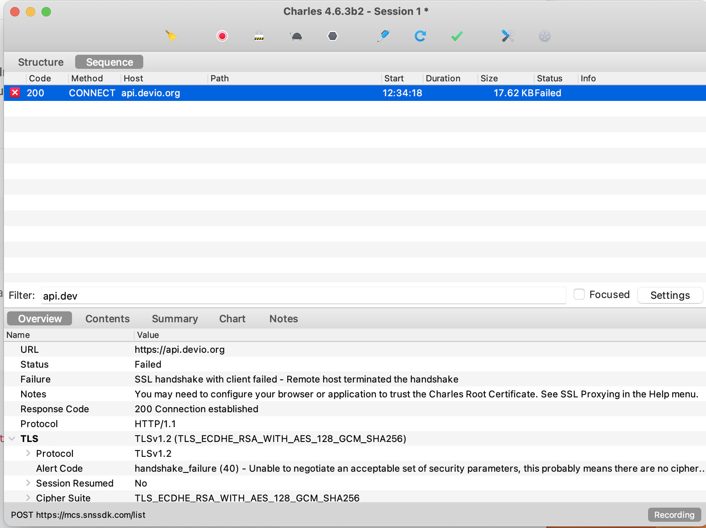
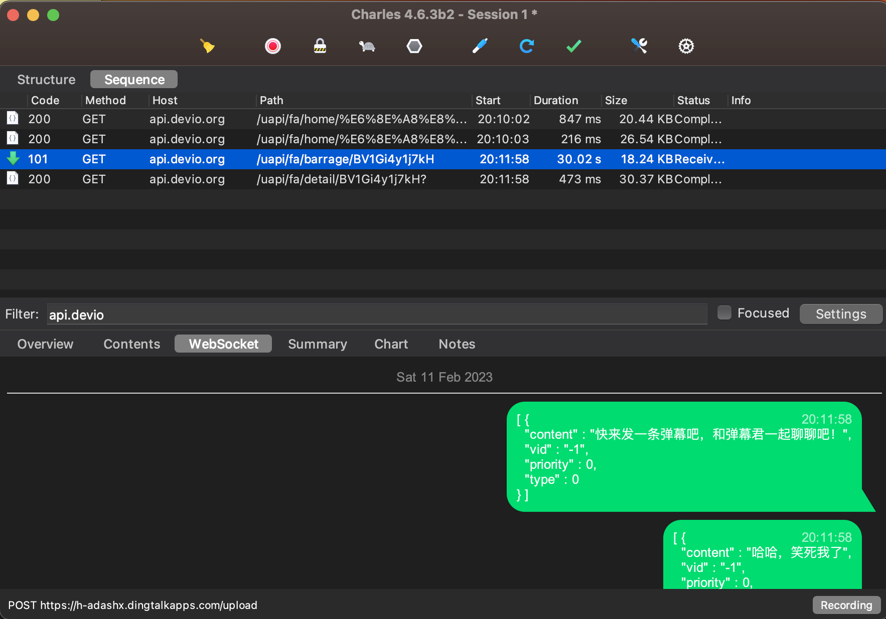

# Flutter配置代理抓包

### 工具准备

1. 安装charles
2. 有时我们需要抓https的请求，此时用charles抓包的内容是加密的，看不到明文，这时候需要安装下Charles的证书来解决。点击` help > SSL Proxying > Install Charles Root Certificate`，安装到系统的钥匙串中。（这里借下了光哥小册里的截图）


点击证书，将`信任`选项改成`始终信任`


1. 开启charles的代理。开启后，确认`Proxy`选项卡与下方画红线的地方显示一样

### 配置Flutter代理

完成工具准备后，由于Flutter默认不走系统代理，所以我们还需要手动在`Flutter`项目中配置代理，`charles`才能正确抓到包。这里提供两种方案，一种是在请求库的配置里设置代理，另一种是利用`Flutter`原生的类来完成

#### 方式一、http请求库配置代理

##### `dio`配置代理

flutter项目里通常用`dio`库做http请求，我们可以通过dio的`httpClientAdapter`属性配置我们的本地代理。代码如下：

```dart
import 'package:dio/dio.dart';

var dio = Dio();
(dio.httpClientAdapter as DefaultHttpClientAdapter).onHttpClientCreate =
  (client) {
  client.findProxy = (uri) {
    return 'PROXY localhost:8888';
  };
  client.badCertificateCallback =
    (X509Certificate cert, String host, int port) => true; //忽略证书
};
```

其中`client.findProxy`函数用来返回我们的代理接口，charles的默认的系统代理端口是`8888`，所以这里配置成

`PROXY localhost:8888`就可以了。下面一句`client.badCertificateCallback`函数也很关键，如果不进行配置，charles在抓包https请求时会出现下图错误：



这个错误产生的原因，经我查阅网上资料是因为Flutter请求https时用的是自己的CA认证证书，所以charles在认证证书时没有通过，导致抓包错误。所以我们直接通过`client.badCertificateCallback`函数返回`true`来忽略证书就好了。

##### `web_socket_channel`配置代理

有了上面`dio`的配置后，还不够，因为我们的`websocket`请求还是无法抓包。如果你项目中需要抓取`websocket`，可以使用`web_socket_channel`这个库。需要注意的是这个库不能从官网拉取，因为官方的`web_socket_channel`的还不支持代理，我在官方的代码仓库看到有几个与支持代理相关的pr请求，但是官方都还没有进行合并分支，所以我就自己fork仓库修改了一下，我们可以改成以下方式进行安装：

```yaml
dependencies:
  web_socket_channel:
      git:
        url: https://github.com/IFreeOvO/web_socket_channel.git
        ref: master
```

然后我们开始配置`web_socket_channel`，不过有了之前配置`dio`的经验后，我们配置`web_socket_channel`也是使用了差不多的思路，代码如下：

```dart
import 'package:web_socket_channel/io.dart';

// 创建一个自己的HttpClient对象
SecurityContext ctx = SecurityContext.defaultContext;
HttpClient client = HttpClient(context: ctx)
  ..findProxy = ((uri) {
    return 'PROXY localhost:8888';
  })
  ..badCertificateCallback = (cert, host, port) {
  return true;
};

_channel = IOWebSocketChannel.connect(
  'wss://xxx.com',
  customClient: client, // 使用定制的HttpClient
);
```


#### 方式二、重写原生方法

在入口文件`main.dart`里定义一个`HttpOverrides`的子类，重写它的`createHttpClient`方法。原理也是一样的，把`findProxy`和`badCertificateCallback`方法进行替换。然后挂载到全局。

```dart
// 重写HttpOverrides
class MyHttpOverrides extends HttpOverrides {
  @override
  HttpClient createHttpClient(SecurityContext? context) {
    var http = super.createHttpClient(context);
    http.findProxy = (uri) {
      return 'PROXY localhost:8888';
    };
    http.badCertificateCallback =
        (X509Certificate cert, String host, int port) => true;
    return http;
  }
}

void main() {
  HttpOverrides.global = MyHttpOverrides(); // 使用自己的HttpOverrides类
  runApp(MyApp());
}
```

这种方案的好处是不受第三方请求库限制，配置完后`https`和`websocket`都能正确抓包。效果如图：


