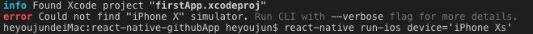

# mac运行rn遇到的报错及其解决方案.md

## 采用的技术栈及环境

- react 16.8.6
- react-native 0.60.5
- mac ios
- xcode 11.0

## 一、error Could not find "iPhone X" simulator

解决方案：换个模拟器开启
指令为：`react-native run-ios --simulator="iPhone 11 Pro"`

## 二、React-Native 'React/RCTBridgeModule.h' file not found

解决方案: cd ios  目录下，执行 pod install --verbose --no-repo-update (建议翻墙)之后再重新运行一下react-native run-ios

## 三、error: unable to find utility "simctl"

解决方案：在XCode -> Preferences -> Locations中设置Command line tools(选择一个版本即可)。

## 四、No bundle URL present

原因：
可能是js远程调试没关，端口被占用，把调试页面关闭即可正常运行。如果还不行采用下面的方案
解决方案：
1、先把ios/build文件夹先删除
2、开启第一个终端，输入react-native start
3、开启第二个终端，输入react-native run-ios
