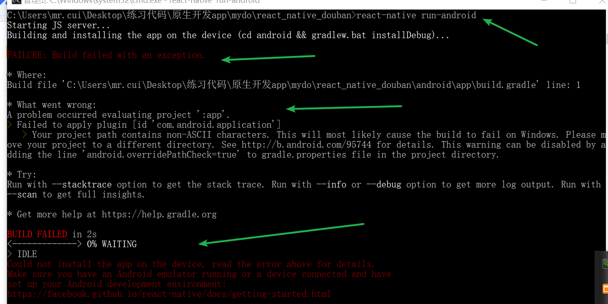
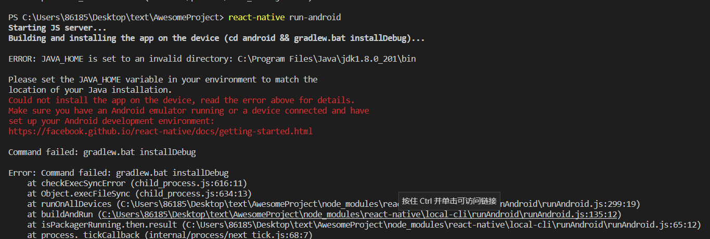
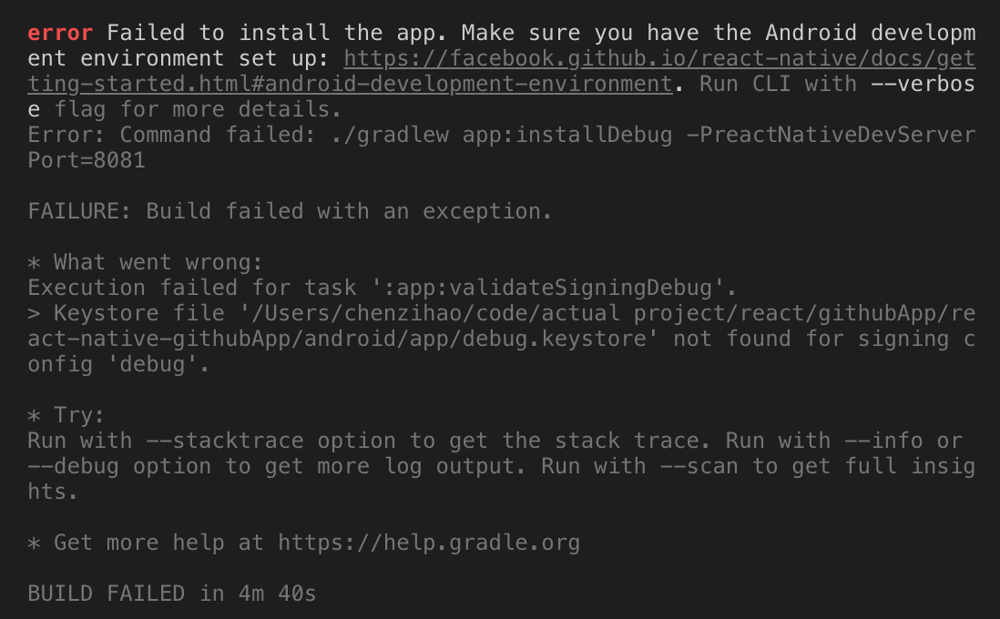

# 【RN踩坑】安卓运行rn遇到的报错及其解决方案

## 采用的技术栈及环境

- react 16.8.6
- react-native 0.60.5
- window 10

## 一、Failed to install the following Android SDK packages as some licences have not been accepted

解决方案：
打开cmd命令行
cd     c:\Users\你的用户名\AppData\Local\Android\Sdk
cd     tools
cd     bin
执行 sdkmanager.bat --licenses 命令
然后后面所有的都敲  Y ，搞定。

## 二、

解决方案：
将项目放在英文路径下即可(应该是中文路径解析不出来的原因)

## 三、

解决方案：
没有正确配置java环境导致的。按网上教程配置一下，然后重新打开命令行工具执行一下就好了

## 四、Failed to apply plugin Minimum supported Gradle version is 3.3. Current version is 2.14.1. If using the gradle wrapper, try editing the distributionUrl in  gradle-3.3-all.zip

解决方案：
安卓sdk版本不匹配。

- 方案1：修改项目安卓目录下的`gradle-wrapper.properties`的`distributionUrl`参数。修改`build.gradle`文件里的版本参数配置
- 方案2：升级或降级本地的安卓sdk版本

## 五、com.android.builder.testing.api.DeviceException: No connected devices

解决方案：
这是因为没有连接调试设备报的错。可以用`adb devices`检查一下连接的设备中是否有模拟器。
没有的话，用`adb connect 127.0.0.1:62001`命令连接设备。模拟器的端口可以通过`netstat -ano | findstr "18176"`命令进行查询

## 六、安卓真机调试开启热更新报错 Error: The packager server has restarted since the last Hot update. Hot Reloading will be disabled until you reload the application

解决方案：
删除真机上的app,重新安装即可

## 七、error: Can't find the 'node' binary to build the React Native bundle

解决方案：
重新安装node，因为mac上用`nvm`安装的话会找不到正确安装路径了(报错前我用nvm安装的)

## 八、error Failed to install the app. Make sure you have the Android development environment set up

解决方案：
在项目根目录下执行`chmod 755 android/gradlew` ,然后再执行`react-native run-android`

## 九、FAILURE: Build failed with an exception. * What went wrong: Execution failed for task ':app:validateSigningDebug'

如图：

解决方案：
这个问题的报错原因实际上是安卓app目录下的debug.keystore找不到导致的,从官方模板上下载下来一个，然后拷贝到自己项目里即可
