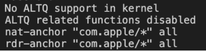

# MacBook本地调试微信sdk

微信配置jssdk使用时需要用到公网地址，并且需要在微信公众号后台配置网站地址白名单后台才能使用。这些都准备好后，又会出现一个问题，就是如何实现在本地输入公网地址后看到的是本地开发出来的页面,方便进行模拟真实环境调试。

## 一、修改hosts文件，将域名映射到本地IP地址

```bash
$ sudo vim /etc/hosts
# 在host文件底部添加以下内容
127.0.0.1 test.demo.com
192.168.xx.xx test.demo.com
```

修改完后，输入`test.demo.com`可以看到我们本地开发的页面，但是`js-sdk`会报错`valid url domain`，因为sdk配置仅支持80和443两个端口。而我们本地开启的是8080端口，所有需要将8080端口转发到80端口。

## 二、将本地项目的8080端口转发到80端口

在进行操作前我们可以先查看有没有其他进程在监听80端口，命令是`lsof -i -P -n | grep LISTEN`。
如果没有，我们接着通过`sudo pfctl -s nat`查看本机端口转发规则。未加任何规则之前会显示如下：

然后输入命令`echo " rdr pass inet proto tcp from any to any port 80 -> 127.0.0.1 port 8080" | sudo pfctl -ef -`将本地8080接口转发到80。然后再次查询端口转发规则，控制台会出现如下提示,说明添加规则成功：

```bash
No ALTQ support in kernel
ALTQ related functions disabled
rdr pass inet proto tcp from any to any port = 80 -> 127.0.0.1  port 8080
```

以后如果需要删除规则表里所有的规则，可以通过执行`sudo pfctl -F all -f /etc/pf.conf`进行删除。
完成上述操作后，我们的vue项目转发端口，页面会返回`Invalid Host header`，此时，还需要我们在`devServer`配置里增加一个选项：

```bash
devServer: {
  ...
  disableHostCheck: true,
  ...
}
```

到这步为止，我们完成了本地调试微信sdk，打开`test.demo.com`可以看到我们本地写的项目了。
不过，我们还需要加个需求，就是希望在手机上访问`test.demo.com`这个地址也可以看到我们本地写的项目

## 三、搭建代理服务器

1. 下载[SquidMan](http://squidman.net/squidman/)这个软件。
2. 启动SquidMan，打开`Preferences`-`General`修改`HTTP Port`为8087(随便写个没被占用的端口)
3. 在`Preferences`-`Template`，将`Deny requests to certain unsafe ports`和`Deny CONNECT to other than secure SSL ports`按下面的文字进行修改

```bash
# Deny requests to certain unsafe ports
http_access allow all

# Deny CONNECT to other than secure SSL ports
http_access allow to_localhost
```

3.点击保存，启动SquidMan
4.让手机和macbook进入同一个局域网
5.修改iphone局域网设置，在`设置`-`无线局域网`-`http代理`-`手动`，配置代理服务器，主机名用macbook的ip，端口设置为8087
6.打开手机浏览器输入`test.demo.com`调试成功

## 四、【扩展】windows本地如何转发8080到80端口

我们可以在自己电脑上搭建一个nginx服务器，配置如下

```bash
upstream demo{
        server 127.0.0.1:8080;
        keepalive 64;
 }
 server {
   listen 80;
   server_name  test.demo.com;
   location / {
    proxy_pass  http://demo; 
  }
}
```

配置完成后重启nginx，大功告成。
此外，windows搭建本地代理服务器可以通过百度关键词`windows 代理服务器`搜索到。

## 相关文献

[手把手教你如何在Mac本地调试微信JS SDK](https://www.jianshu.com/p/f6808f12a49f)
