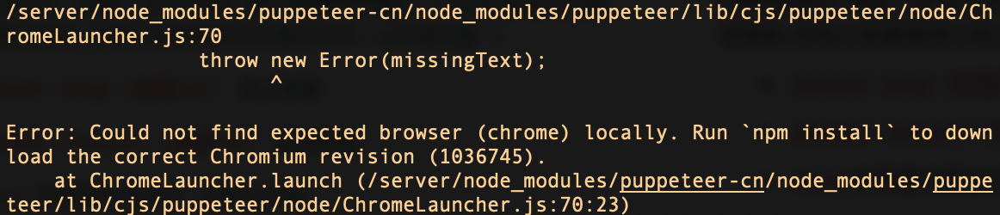

# docker上puppeteer运行失败的问题

## 问题描述
&nbsp;&nbsp;&nbsp;&nbsp;最近在docker上部署了一个含有puppeteer包的node服务，启动容器后出现下图中的错误。

&nbsp;&nbsp;&nbsp;&nbsp;意思就是找不到可运行chorme浏览器。所以解决思路很清楚：**就是想办法在
docker环境中把浏览器安装上**。
<br>
&nbsp;&nbsp;&nbsp;&nbsp;虽然看起来简单，但是我在实践中还是踩了不少坑，比如puppeteer官网上的的【故障排除】文中虽然写了docker上的运行方案，
但是实测时代码压根跑不起来。然后我又在网上查询其他资料，有些是基于含有puppeteer的镜像构建的，不符合我的要求，因为我希望镜像大小和镜像的puppeteer版本可以自己控制，
就没有采用并尝试。其他基于系统镜像的方案也试了跑不起来，基本都是在安装浏览器时安装失败。
  不过在我阅读了很多资料后，还是摸索出了一个成功可行的安装方案，所以本文主要讲述的就是如何基于我的方案解决docker上puppeteer的安装问题。

## 解决方案
本文用一个简单的案例，来讲述具体怎么处理docker上的puppeteer(本文版本是18.x.x)

1. 首先找个空文件夹，执行`npm init -y`和`npm install puppeteer-core koa`

2. 接着创建一个demo，在根目录新增`index.js`，内容如下
```js
const puppeteer = require('puppeteer-core');
const Koa = require('koa');
const app = new Koa();

app.use(async ctx => {
  const browser = await puppeteer.launch({
    headless: true,
    executablePath: 'google-chrome-stable', // 使用额外安装的谷歌浏览器
    args: ['--no-sandbox'] // 这个参数不加，会运行报错
  });

  // 尝试用无头浏览器爬取百度的网站log0
  const page = await browser.newPage();
  await page.goto('https://baidu.com');
  const bodyHandle = await page.$('[rel=icon]')
  const data = await page.evaluate(dom => dom.href, bodyHandle);
  await bodyHandle.dispose()
  await browser.close();

  // 如果测试通过，接口会返回百度logo
  ctx.body = {
    code: 200,
    data: data
  };
});

app.listen(3000)
```

3. 再创建一个`sources.list`文件
```
# 阿里云镜像http://developer.aliyun.com/mirror/?serviceType=&tag=&keyword=debian
# 这里改成http地址，不然apt-get update会出现No system certificates available报错
deb http://mirrors.aliyun.com/debian/ buster main non-free contrib
deb-src http://mirrors.aliyun.com/debian/ buster main non-free contrib
deb http://mirrors.aliyun.com/debian-security buster/updates main
deb-src http://mirrors.aliyun.com/debian-security buster/updates main
deb http://mirrors.aliyun.com/debian/ buster-updates main non-free contrib
deb-src http://mirrors.aliyun.com/debian/ buster-updates main non-free contrib
deb http://mirrors.aliyun.com/debian/ buster-backports main non-free contrib
deb-src http://mirrors.aliyun.com/debian/ buster-backports main non-free contrib
```

4.然后创建最关键的`Dockerfile`
```docker
FROM node:16-slim

# 替换阿里云镜像
COPY sources.list /etc/apt/sources.list

# 单独安装谷歌浏览器
RUN apt-get update   
RUN apt-get install curl -y
RUN curl -LO https://dl.google.com/linux/direct/google-chrome-stable_current_amd64.deb
RUN apt-get install -y ./google-chrome-stable_current_amd64.deb
RUN rm google-chrome-stable_current_amd64.deb 

# 目前我们用的是puppeteer-core包。如果项目用的是puppeteer包，请取消下面注释。
# ENV PUPPETEER_SKIP_CHROMIUM_DOWNLOAD=true 

# 复制文件到镜像的app目录下
COPY index.js /app/
COPY package.json /app/

# 装包
WORKDIR /app
RUN npm set registry http://registry.npm.taobao.org/ 
RUN npm install

EXPOSE 3000
ENTRYPOINT node index.js
```
&nbsp;&nbsp;&nbsp;&nbsp;这里有几点需要说明一下，第一点，我们的用的`node:16-slim`是基于`debian`系统的，`apt-get`是`debian`系统上的软件安装工具，
类型于前端的npm，如果直接用`apt-get`装包会非常的慢,大约要一个多小时，所以我从阿里云镜像站找了`debian`系统的下载镜像(PS:我之前尝试的方案,
失败原因也是因为请求外网下载超时，或连接不上)，
来提高下载速度，`node:16-slim`对应的`debian`版本是`10.x`，可以在容器里执行`cat /etc/debian_version`查看`debian`的版本，
然后去[阿里云镜像](https://developer.aliyun.com/mirror/debian?spm=a2c6h.13651102.0.0.7fb11b11tS5vjI)，复制对应版本的`sources.list`内容，
放到项目的`sources.list`文件。`Dockerfile`里`COPY sources.list /etc/apt/sources.list`这行的作用就是复制项目文件替换镜像里的`sources.list`，以便使用
阿里云镜像进行下载
<br/>
&nbsp;&nbsp;&nbsp;&nbsp;第二点，我们demo里用的是`puppeteer-core`包，与`puppeteer`的区别是里面不含浏览器依赖的，
理论上docker环境中也用不了`puppeteer`包捆绑安装的浏览器，不然也不会出现这篇文章。如果你的项目里用的是`puppeteer`，
就需要在`Dockerfile`里加上环境变量`ENV PUPPETEER_SKIP_CHROMIUM_DOWNLOAD=true `来避免安装捆绑的浏览器

5. 一切准备就绪后，我们运行容器试一下
```
docker build . -t pptr
docker run -p 3000:3000  --name pptr -d pptr:latest
```
然后请求`http://127.0.0.1:3000`，接口会正常返回百度网站的logo，说明puppeteer在docker环境上成功运行了


## 后记
回顾解决方案，我们可以发现，这个问题本质上就是要学会如何在服务器上安装浏览器，所以你的项目如果是部署centos,ubantu这些环境，
也可以作为参考，然后根据系统提供的装包工具，把它的镜像源换成国内的，再进行安装浏览器即可

## 参考文献
* [puppeteer官方FAQ](https://pptr.dev/troubleshooting/#running-puppeteer-in-docker)
* [阿里云debian镜像站](https://developer.aliyun.com/mirror/?serviceType=&tag=&keyword=debian)
* [apt-get update 一直报证书错误 Certificate verification failed](https://juejin.cn/post/6844904106050453511)
* [如何在基于Ubuntu 19.10和20.04的Docker中安装chromium](https://cloud.tencent.com/developer/ask/sof/1381506/answer/1899918)
*  [截图的诱惑：Docker部署Puppeteer项目](https://juejin.cn/post/6844903688457175047#heading-12)
* [docker 部署 puppeteer](https://juejin.cn/post/7113750855745601573)
* [Linux debian 11上安装 Google Chrome浏览器教程](https://blog.csdn.net/u013541325/article/details/123922717)
* [CentOS 8 安装puppeteer 运行报错解决方式](https://www.jianshu.com/p/f3df96e38a0f)