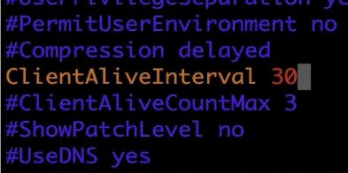

# 解决当ssh连接服务器长时间未操作,系统会自动断开连接

## 问题描述

用ssh连接远程服务器，如果长时间未操作，控制台会打印`broken pipe`，即中断我们与远程服务器的连接

## 解决方案

1.连接远程服务器，执行`vim /etc/ssh/sshd_config`，修改配置文件为`ClientAliveInterval 30`，如下图

2.`service sshd restart` 重启服务
