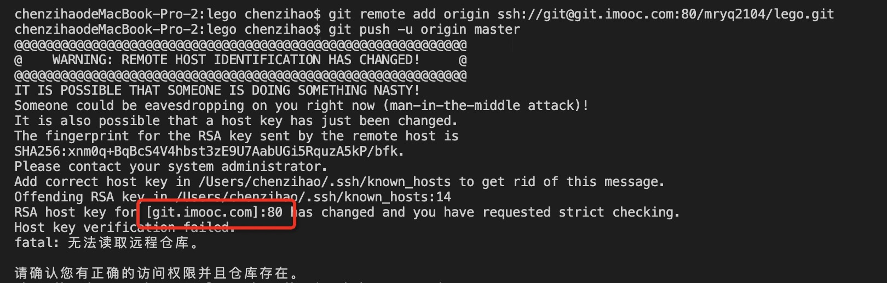

# 远程配置了公钥，但是git依然提交失败

## 问题描述

远程新键的仓库，刚配置好公钥，提交代码失败，控制台报错如下:



大概意思应该是远程服务器的密钥变更过了，本地需要更新一下远程服务器的密钥

## 解决方案

执行下面命令删除本地`~/.ssh/known_hosts`文件里的旧密钥

```bash
ssh-keygen -R [git.imooc.com]:80       // 删除网站的旧密钥([git.imooc.com]:80 这个按报错提示里的写)
```

然后重新用Git提交代码，控制台会自动提示你是否需要保存远程主机的密钥，之后就可以正常提交代码了
