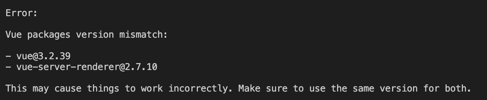

# monorepo项目出现版本冲突

## 问题描述
最新做了一个项目运用了`monorepo`来管理项目，主包运用的是`vue3.0`技术，子包里用的`vuepress`依赖了`vue2.0`，
此时运行子包的`vuepress`就会产生如下图的报错：


## 问题原因
问题产生原因在于子包安装依赖的路径会提升，与主包依赖一起安装到根目录的`node_modules`里，然后`vue-server-render@2.7.10`的包，恰好和`vue@3.2.39`、`vue@2.7.10`在同一级，`vue-server-render@2.7.10`里的文件优先使用了`vue@3.2.39`的包，导致版本出现不一致的情况

## 解决方案
在根目录的`package.json`加入`nohoist`字段，它的作用是不提升`vuepress`依赖，这样相当于`vuepress`在子包的`node_modules`下安装依赖。
跟独立项目运行的效果是一样的
```json
{
  "private": true,
  "workspaces": {
    "packages": [
      "packages/*"
    ],
    "nohoist": [
      "**/vuepress", // 任意目录下的依赖vuepress不提升
      "**/vuepress/**" // vuepress的依赖也不提升
    ]
  }
}

```