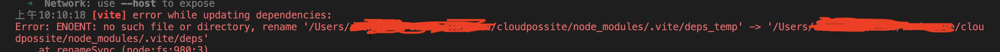

# vite加载模块报错

## 问题描述

项目启动成功后，加载本地模块依赖的请求全部返回503，控制台提示`error while updating dependencies`。
大概意思是本地找不到对应依赖文件供服务器返回，报错如下图：


## 解决方案

在`vite.config.js`里加入`force: true`强制依赖更新。

```js
export default defineConfig({
  optimizeDeps: {
    force: true
  }
})
```

等消除控制台报错后，再删除这项配置即可
