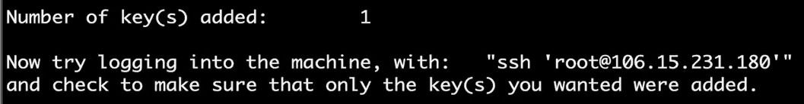

# ssh免密登录阿里云服务器

1. 在自己电脑上生成公钥/私钥对(如果已经生成则跳过)
`ssh-keygen -t rsa`
然后一直按回车键
2. 将公钥复制到阿里云服务器上。
`ssh-copy-id -i ~/.ssh/id_rsa.pub root@192.168.xxx.xxx`
此时会提示，需要输入一次服务器登录密码。
出现如下提示，说明复制成功

3. 修改自己电脑上的host文件(该步骤是为了用自定义名称来代替ip地址)
执行`sudo vim /etc/hosts`编辑hosts文件
在hosts文件中添加一行`192.168.xxx.xxx   自定义名称`
1. 现在可以免密连接我们的阿里云服务器了(如果不做第三步操作，那这里就得写成`ssh root@192.168.xxx.xxx`)
执行`ssh root@自定义名称`
