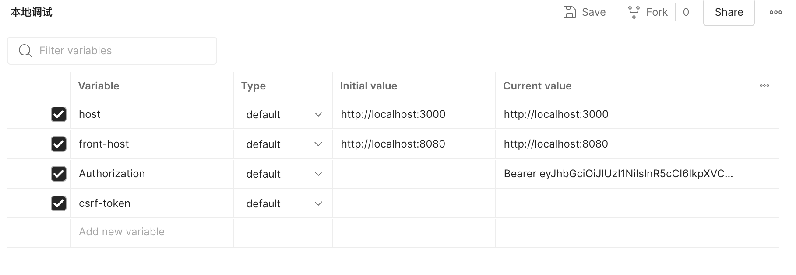
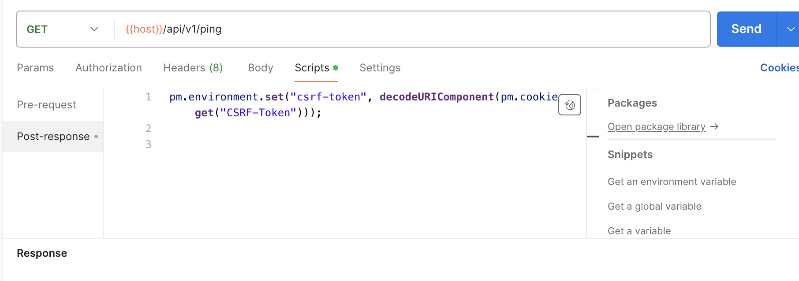
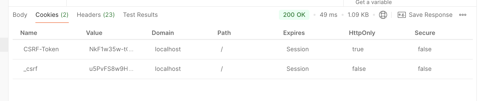
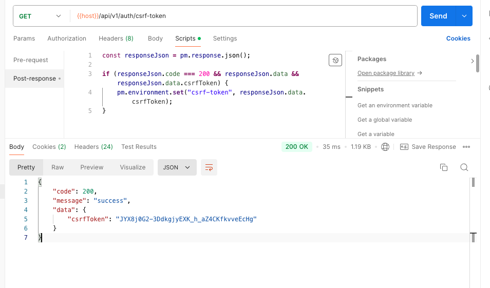
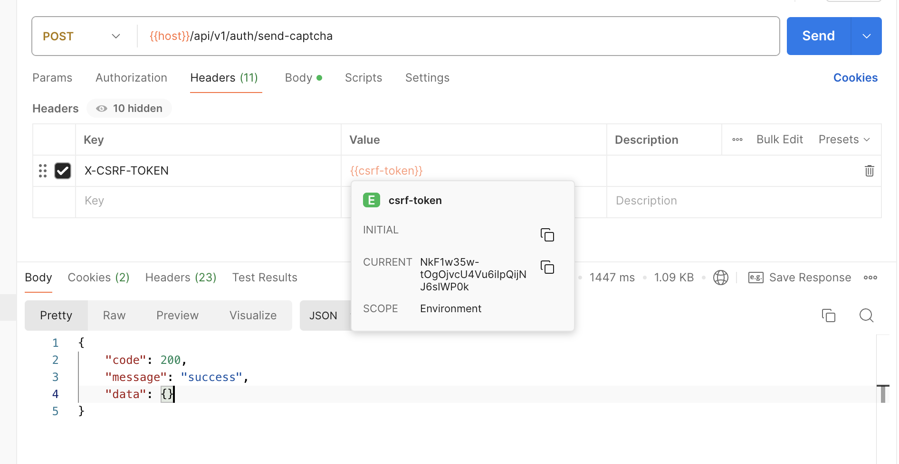

# postman如何自动携带csrftoken

## 背景

我给nestjs安装了`csurf`库，用于处理csrf攻击。之后用postman调试接口报错403错误`invalid csrf token`。

先贴一下nestjs的`csurf`配置， 后续会用到：

```ts
app.use(cookieParser())
app.use(
    csurf({
        cookie: true,
    }),
)
app.use((req: any, res: any, next: any) => {
    const token = req.csrfToken()
    res.cookie('CSRF-Token', token, {
        httpOnly: true,
    })
    res.locals.csrfToken = token
    next()
})
```

其中`res.cookie('CSRF-Token')`这段代码，表示会在客户端存储一个叫`CSRF-Token`的cookie。后续我们会用到，当前这个cookie的也可以自定义名称

## 流程

### 1.先去`Environments`选项卡添加环境变量

比如我这里设置的是`csrf-token`，后面的value值暂时先不填，后面我们会通过脚本自动填充value



### 2. 开发一个get接口返回csrftoekn，或者找个免登录的GET请求，添加自定义`scripts`

* 使用`一个免登录GET请求`方式
在`Post-response`选项卡里设置脚本

```js
pm.environment.set("csrf-token", decodeURIComponent(pm.cookies.get("CSRF-Token")));
```

这段代码作用是，接口请求成功时，将cookie里`CSRF-Token`的值赋值给postman环境变量`csrf-token`。其中`CSRF-Token`就是我们上面提到的nestjs后端代码里写的cookie名称，与它保持一样的名字即可。`csrf-token`对应的是我们在postman里自定义的环境变量，也是要保持一样的名字



请求成功后，可以在postman上看到接口响应返回的cookie。图里`CSRF-Token`里的value值就是`csrf-token`环境变量里此时存的值


* 使用接口返回csrftoken方式
  
在`Post-response`选项卡里设置脚本

```js
const responseJson = pm.response.json();

if (responseJson.code === 200 && responseJson.data && responseJson.data.csrfToken) {
    pm.environment.set("csrf-token", responseJson.data.csrfToken);
}
```



### 4. 添加请求头

比如现在我们要测一个post接口，在请求头里添加`X-CSRF-TOKEN`，值填写为我们之前写的环境变量`csrf-token`。
鼠标悬停在`csrf-token`上面可以看到当前的值(`CURRENT`)和刚才cookie里返回的值一样，说明设置成功了。再次发送请求，就不会报`invalid csrf token`错误了


