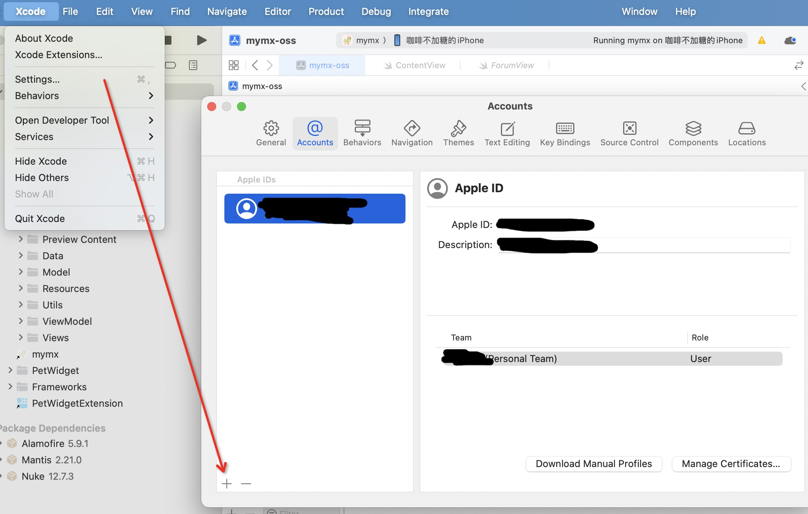
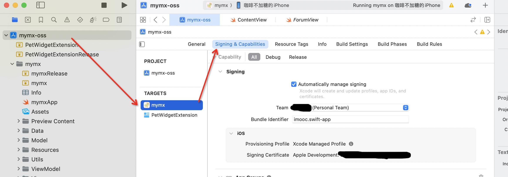
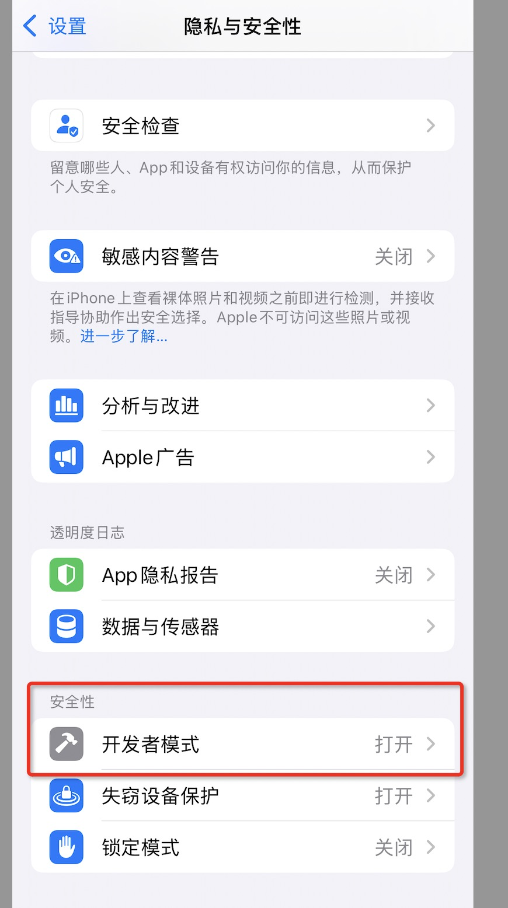
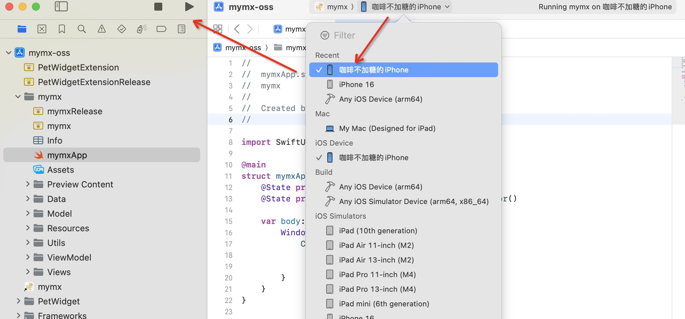
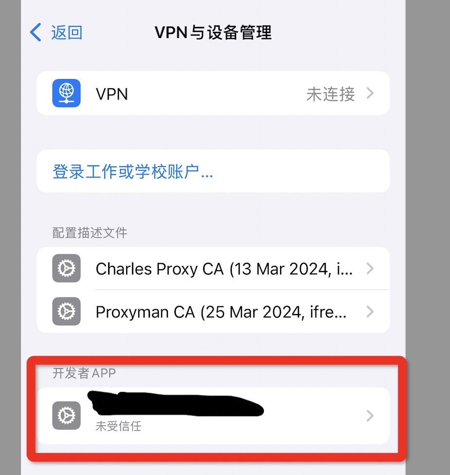

# Xcode16免费苹果账号如何真机调试

## 调试步骤

### 1. 添加苹果账号

打开`xcode`，在顶部菜单`xcode->setting-accounts`项目里配置苹果账号

### 2. 配置项目签名

在左侧文件导航里，双击项目名称(例如示例中的`mymx-oss`)，点击`TARGETS->Signing & Capabilities`。勾选`Automatically nage signing`，选择`team`为自己的苹果账号，`Bundle identifier`设置为`xxx.xxx`这个保证不跟其他项目重复即可。我这个随便写了个`imooc.swift-app`

### 3. 手机打开开发者模式

以`ios 18.0版本`为例，在`设置->隐私与安全性->开发者模式`设置为`打开`，设置完会重启手机
 

### 4. 用数据线连接电脑和手机。在代码顶部导航选择调试设备为自己的手机，然后点击箭头运行项目。如果构建成功会提示`Build Success`，失败的话根据报错调试下代码和项目配置

### 5. 手机信任APP

 第一次在真机运行代码时，如果手机没有信任APP，也会连接不了真机。此时需要用手机，在`设置->通用->VPN与设备管理->开发者APP`里，信任我们的APP。之后，重新按`步骤4`运行代码即可
 
