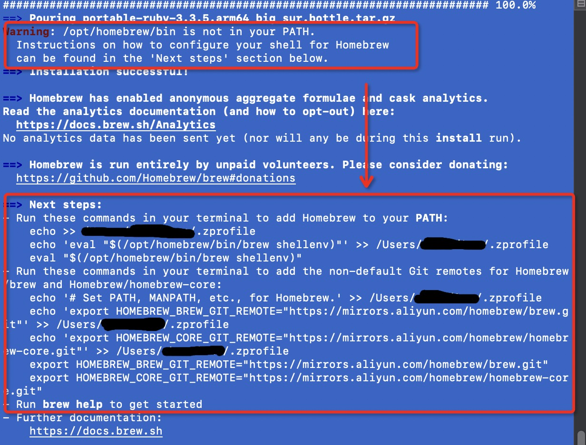

# macos使用国内镜像安装homebrew.md

## 步骤

### 1.下载Homebrew安装脚本

找个空文件，用git从阿里云下载安装脚本

```bash
git clone https://mirrors.aliyun.com/homebrew/install.git brew-install
```

下载完，进入`brew-install`文件夹

### 2.修改脚本

打开`install.sh`文件搜索关键字`HOMEBREW_BREW_DEFAULT_GIT_REMOTE`，把

```shell
HOMEBREW_BREW_DEFAULT_GIT_REMOTE="https://github.com/Homebrew/brew"
HOMEBREW_CORE_DEFAULT_GIT_REMOTE="https://github.com/Homebrew/homebrew-core"
```

替换成

```shell
HOMEBREW_BREW_DEFAULT_GIT_REMOTE="https://mirrors.ustc.edu.cn/brew.git"
HOMEBREW_CORE_DEFAULT_GIT_REMOTE="https://mirrors.ustc.edu.cn/homebrew-core.git"
```

### 3. 设置homebrew安装源为阿里源

在终端执行下面代码

```bash
# bash 用户
echo 'export HOMEBREW_API_DOMAIN="https://mirrors.aliyun.com/homebrew-bottles/api"' >> ~/.bash_profile
echo 'export HOMEBREW_BREW_GIT_REMOTE="https://mirrors.aliyun.com/homebrew/brew.git"' >> ~/.bash_profile
echo 'export HOMEBREW_CORE_GIT_REMOTE="https://mirrors.aliyun.com/homebrew/homebrew-core.git"' >> ~/.bash_profile
echo 'export HOMEBREW_BOTTLE_DOMAIN="https://mirrors.aliyun.com/homebrew/homebrew-bottles"' >> ~/.bash_profile
source ~/.bash_profile


# zsh 用户
echo 'export HOMEBREW_API_DOMAIN="https://mirrors.aliyun.com/homebrew-bottles/api"' >> ~/.zshrc
echo 'export HOMEBREW_BREW_GIT_REMOTE="https://mirrors.aliyun.com/homebrew/brew.git"' >> ~/.zshrc
echo 'export HOMEBREW_CORE_GIT_REMOTE="https://mirrors.aliyun.com/homebrew/homebrew-core.git"' >> ~/.zshrc
echo 'export HOMEBREW_BOTTLE_DOMAIN="https://mirrors.aliyun.com/homebrew/homebrew-bottles"' >> ~/.zshrc
source ~/.zshrc
```

::: tip
先配环境变量的目的，是为了后续安装homebrew过程中，所有请求都用阿里云的api，而不是github和其他外网地址。不然会出现各种奇怪的下载错误(笔者试过，即使用了科学上网，进行代理下载，也无法避免。不然也不会写这篇文章记录安装流程)
:::

### 4.安装homebrew

返回`brew-install`的上级目录，在终端执行

```bash
/bin/bash brew-install/install.sh
```

安装成功后，会出现警告

```bash
Warning: /opt/homebrew/bin is not in your PATH.
```

意思是环境变量了还没设置brew。此时使用`brew`命令依然会报错，需要我们继续下一步配置。当然，控制台输出里。也提示了如何去配置：

可以按上面控制台提示的输入`- Run these commands in your terminal to add Homebrew to your PATH:`和`- Run these commands in your terminal to add the non-default Git remotes for Homebrew/brew and Homebrew/homebrew-core:`后面跟着的那一堆命令。

或者手动在`.zprofile`文件里添加

```shell
eval "$(/opt/homebrew/bin/brew shellenv)"
# Set PATH, MANPATH, etc., for Homebrew.
export HOMEBREW_BREW_GIT_REMOTE="https://mirrors.aliyun.com/homebrew/brew.git"
export HOMEBREW_CORE_GIT_REMOTE="https://mirrors.aliyun.com/homebrew/homebrew-core.git"
```

### 5.验证是否安装成功

在控制台执行

```bash
brew -v
```

如果正常显示版本号说明安装成功

## 参考

[阿里云Homebrew镜像](https://developer.aliyun.com/mirror/homebrew?spm=a2c6h.13651102.0.0.4c3a1b11jeXTUW)
