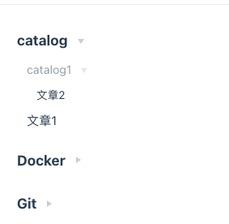

# 使用ts开发vuepress自动生成侧边栏插件

## 开门见山
>
>本文将从零实现一个`vuepress`插件，该插件支持根据目录结构自动生成侧边栏。

例如博客目录如下时：

```md
docs
├─ server
│  |-- catalog
|  |    |-- catalog1
|  |    |     |-- 文章2.md
|  |    |-- 文章1.md
|  |-- docker
|  |-- git
```

生成目录效果如下：
> 

- 读完这篇文章你将收货：
  - [x] 如何开发vuepress插件
  - [x] 如何发布自己的npm包
  - [x] 如何配置eslint、prettier、husky、lint-staged、commitizen、commitlint
  - [x] 如何使用typescript开发项目

## 准备工作

### 初始化项目

找一个空的目录，初始化`package.json`并安装`typescript`

```shell
npm init -y && npm install -D typescript types/node
```

执行`npx tsc --int`生成并配置`tsconfig.json`

```json
{
  "include": ["./src"],
  "compilerOptions": {
    "target": "es2018",
    "module": "commonjs",
    "types": ["node"],
    "outDir": "./lib",
    "forceConsistentCasingInFileNames": true,
    "strict": true,
    "skipLibCheck": true,
    "esModuleInterop": true
  }
}
```

### 代码质量和提交规范

#### 安装eslint

`eslint`安装比较简单，打开终端执行

```shell
npx eslint --int
```

根据命令行交互提示，配置适合自己项目的选项即可

#### 安装prettier

```shell
npm install -D prettier eslint-config-prettier eslint-plugin-prettier
```

然后修改`eslint`配置文件，例如笔者的是`.eslintrc.js`，我们往`extends`属性里添加`prettier`配置

```js
{
  "extends": ["plugin:prettier/recommended"]
}
```

#### 规范commit提交

安装`commitizen`和`cz-conventional-changelog`，帮助我们按照规范进行`commit`提交

```bash
npx commitizen init cz-conventional-changelog
```

再安装校验工具`commitlint`阻止不符合提交规范的`commit`操作

```bash
npm i @commitlint/cli @commitlint/config-conventional -D
```

在根目录下创建 `commitlint.config.js` ，内容如下

```js
module.exports = {
  extends: ['@commitlint/config-conventional']
};
```

要让`commitlint`生效，我们还需安装`husky`来操作`git`钩子，并安装`lint-staged`检查本地暂存代码

```bash
npm install husky lint-staged -D
npm set-script prepare "husky install" // 自动添加husky install到scripts里
npm run prepare
npx husky add .husky/pre-commit "npx --no-install lint-staged" // 添加pre-commit钩子，触发时执行npx lint-staged
npx husky add .husky/commit-msg "npx --no-install commitlint --edit $1"  // 添加commit-msg钩子，触发时执行npx --no-install commitlint --edit "$1"
```

然后在根目录下创建 `.lintstagedrc.json`文件如下

```json
{
    "*.{js,jsx,ts,tsx}": ["prettier --write .", "eslint  --fix"],
    "*.md": ["prettier --write"]
}
```

这样配置好后。提交代码时，工具会帮我们自动校验代码和提交信息。

最后在`package.json`新增一行脚本如下

```json
{
  "scripts": {
    "commit": "cz"
  }
}
```

以后我们可以使用`npm run commit`代替`git commit`进行提交，以避免提交信息不符合规范

### 编写一个简单的插件用例

接着我们创建开发所需要的目录结构，根目录下创建`src`文件夹

```md
src
├─ types
│  └─ index.ts // 存放声明文件
├─ index.ts // 插件入口
└─ autoSidebar.ts // 自动生成侧标栏的核心代码
```

然后去`src/types/index.ts`文件里，提前定义好我们后面要用到的数据类型

```ts
export interface PluginOptions {
  handleSidebar ?: (filesList: Array<string>, filesTree: Sidebar) => Sidebar; // 用于处理sidebar数据
  ignore ?: Array<string>; // 需要忽略的md
  root ?: string; //文档所在目录的绝对路径，默认为docs所在路径
  collapseList ?: Array<string>; // 折叠列表，元素为侧标栏的title
}

export interface SidebarItem {
  title: string; // 文章标题
  path: string; // markdown路径
  collapsable: boolean; // 是否折叠
  sidebarDepth?: number; // 侧边栏深度，默认是1
  children: Array<SidebarItem>;
}

export interface Sidebar {
  [key: string]: Array<SidebarItem>
}

```

在入口文件`src/index.ts`，利用`vuepress`提供的[生命周期函数](https://vuepress.vuejs.org/zh/plugin/life-cycle.html#ready)，写入我们生成侧边栏的逻辑：

```ts
import { Context } from "vuepress-types"; // 需要自行安装vuepress的声明文件
import { PluginOptions, Sidebar } from "./types";
import getSidebar from "./autoSidebar";

module.exports = (options: PluginOptions, ctx: Context) => {
  let AUTO_SIDEBAR_DATA: Sidebar = {};

  return {
    name: "vuepress-plugin-code-copy",

    // 在ready生命周期生成sidebar数据
    async ready() {
      AUTO_SIDEBAR_DATA = getSidebar(options, ctx);
    },

    // 在ready生命周期，动态修改vuepress的启动配置
    // 这里我们需要siteData.themeConfig.sidebar的内容
    // 由于我们要先测试getSidebar函数，先把enhanceAppFiles注释下
    // enhanceAppFiles() {
    //   return {
    //     name: "generate-sidebar-enhance",
    //     content: `export default ({ siteData }) => { siteData.themeConfig.sidebar = ${JSON.stringify(
    //       AUTO_SIDEBAR_DATA
    //     )} }`,
    //   };
    // },
  };
};
```

写好后我们去`src/autoSidebar.ts`简单的写个`getSidebar`进行测试

```ts
function getSidebar(options: PluginOptions, ctx: Context) {
  let sidebar: Sidebar = {};
  console.log('测试')
  return sidebar;
}

export default getSidebar;
```

### 本地调试

代码编写完成后，如何验证插件效果呢？
这里我们先去`package.json`加入新的脚本

```json
{
  // ...
  "scripts": {
    "dev": "tsc -w", // 开发时，可以实时编译我们的ts文件
  },
  // ...
}
```

然后执行`npm run dev`，编译完成后，此时项目里会多出一个`lib`文件夹，里面就是编译后的ts产物。
有了这个我们就可以打开我们`vueopress`项目里的`config.js`配置，引入我们的插件进行调试：

```js
module.exports = {
  // ...
  plugins: [
    // 这里笔者的vuepress项目和插件项目是同级目录。所以直接用相对路径引入。当然你也可以使用npm link联调
    [require('../../../demo/vuepress-plugin-easy-sidebar/lib/index')],
  ]
  // ...
}
```

配置完成后，运行`vuepress dev docs`重启我们的`vuepress`项目，控制台可以看到我们自定义插件里输出的`console.log`

## 完善插件逻辑

当插件可以正常跑起来后，可以开始继续实现自动生成侧边栏的逻辑。不过，在此之前，我们先来简单梳理下实现逻辑。

### 自动生成目录原理

首先，我们会先通过`glob`工具获取`docs`文件夹下所有`markdown`文件路径，
大致像这样：

```js
['web/js/demo.md', 'web/js/1.md', 'web/es6/2.md']
```

然后我们需要把每条路径转换成树结构，例如`'web/js/demo.md'`会转换成下面这种结构：

```js
{
   '/web/': [
     {
       title: 'js',
       path: ''
       children: [
         {
           title: 'demo',
           path: '/web/js/demo',
           children: []
         }
       ]
     }
   ]
}
```

根据路径我们分析下规律，还是以`'web/js/demo.md'`为例子。我们以`/`分割路径后，会得到`['web','js', 'demo.md' ]`。数组的第一个元素一定是`sidebar`对象的键，最后一个元素一定是文件名称。而`web`和`demo.md`之间可能隔离好几层文件夹(本例中只隔了一个`js`文件夹)，即数组中间部分。然后我们要做的就是把除`web`外的每个数组元素，转换成一个树节点，结构如下

```js
{
    title: '', // 如果元素是文件夹，则title为文件夹名。如果数据元素是markdown文件，则title为文件名
    path: '' // 只有元素时文件时，才需要写入具体路径
    children: [
    ] // 只有元素是文件时，才需要写入子节点数据
}
```

### 代码实现

根据上面的思路，我们就可以动手写自动生成侧边栏的逻辑部分，代码如下

```ts
import { Context } from "vuepress-types";
import glob from "glob";
import merge from 'merge'
import { PluginOptions, Sidebar, SidebarItem, CreateNodeParams } from "./types";

const IGNORE_FILES: Array<string> = [
  ".vuepresss",
  "**/README.md",
  "**/index.md",
]; // README.md和index.md不算入侧边栏

// 判断节点是否创建过
function getNodeIndex(treeNodes: Array<SidebarItem>, title: string): number {
  return treeNodes.findIndex(
    (childNode: SidebarItem) => childNode.title === title
  );
}

// 判断是否要折叠
function isCollapsed(collapseList: Array<string>, title: string): boolean {
  if (collapseList.length === 0) {
    return true
  }
  return collapseList.includes(title);
}

/**
 * @param params.children 子节点
 * @param params.pathArr 被拆解的路径，例如文件路径'/web/js/es6/demo.md'，则pathArr为['js','es6']即路径中间的文件
 * @param params.resolvePath 已解析的路径，每递归一次，路径加一层，例如文件路径'/web/js/es6/demo.md'，第一次遍历结果'/web/js/', 第一次遍历结果'/web/js/es6/'
 * @param params.fileName 当前markdown名称
 * @param params.options 插件配置
 * @returns
 */
function findAndCreateNode(params: CreateNodeParams) {
  let { children, pathArr, resolvePath, fileName, options } = params;
  const collapseList = options.collapseList || [];
  if (pathArr.length === 0) {
    // 遍历到叶子节点时，path一定有值，children一定为空数组
    children.push({
      title: fileName,
      path: `${resolvePath}/${fileName}`,
      children: [],
      collapsable: isCollapsed(collapseList, fileName),
    });
  } else {
    const dirName: string = pathArr.splice(0, 1)[0];
    const childNodeIndex: number = getNodeIndex(children, dirName);
    const currentResolvePath = `${resolvePath}/${dirName}`;

    if (childNodeIndex === -1) {
      // 如果没有title为dirName的节点则创建
      children.push({
        title: dirName,
        path: "",
        children: [],
        collapsable: isCollapsed(collapseList, dirName),
      });
      // 遍历子节点
      const lastNodeIndex: number = children.length - 1;
      const dirNode: SidebarItem = children[lastNodeIndex];
      findAndCreateNode({
        children: dirNode.children,
        pathArr,
        resolvePath: currentResolvePath,
        fileName,
        options,
      });
    } else {
      // 遍历子节点
      const dirNode: SidebarItem = children[childNodeIndex];
      findAndCreateNode({
        children: dirNode.children,
        pathArr,
        resolvePath: currentResolvePath,
        fileName,
        options,
      });
    }
  }
}

/**
 * 将路径列表转成树
 */
function listToTree(options: PluginOptions, list: Array<string>): Sidebar {
  let tree: Sidebar = {};
  for (let i = 0; i < list.length; i++) {
    const markdownPath: string = list[i];
    // 将路径拆分。例如'web/js/es6/demo.md'拆成web,['js','es6'],demo.md
    const pathArr: Array<string> = markdownPath.split("/");
    const category: string = pathArr.splice(0, 1)[0];
    const fileName: string = pathArr
      .splice(pathArr.length - 1, 1)[0]
      .replace(".md", "");
    const categoryKey: string = `/${category}/`;
    if (!(categoryKey in tree)) {
      tree[categoryKey] = [];
    }
    findAndCreateNode({
      children: tree[categoryKey],
      pathArr,
      resolvePath: `/${category}`,
      fileName,
      options,
    });
  }

  return tree;
}

function getSidebar(options: PluginOptions, ctx: Context) {
  const defaultOptions: PluginOptions = {
    ignore: [],
    root: ctx.options.sourceDir,
    collapseList: []
  }
  const pluginOptions: PluginOptions = merge.recursive(defaultOptions, options)
  let sidebar: Sidebar = {};
  const ignore: Array<string> = options.ignore || [];
  // 获取所有markdown文件
  const filesList: Array<string> = glob.sync("**/*.md", {
    cwd: pluginOptions.root,
    ignore: [...IGNORE_FILES, ...ignore],
  });
  // 路径转树结构
  sidebar = listToTree(pluginOptions, filesList);

  // 方便用户定制自己的侧边栏数据
  if (pluginOptions.handleSidebar) {
    sidebar = pluginOptions.handleSidebar(filesList, sidebar);
  }

  return sidebar;
}

export default getSidebar;

```

然后将`src/index.ts`文件里的`enhanceAppFiles`取消注释。重新运行`vuepress dev docs`测试下插件，一切运行正常，侧边栏效果也符合我们预期。

## 发布npm包

完成插件后，咱们的最后一步便是打包成npm包发布。这里主要是改一下`package.json`。
这里仅贴一下关键几处改动：

```json
{
  "name": "vuepress-plugin-easy-sidebar", // 包名，
  "version": "1.0.0", // 包版本号
  "description": "a vuepress plugin for generate sidebar",
  "main": "lib/index.js", // 入口文件。别人用你的包时，会先执行这个文件
  "types": "lib/types/index.d.ts",
  "files": [ // 包里存在哪些文件
    "lib",
    "README.md"
  ],
  "scripts": {
    "dev": "tsc -w",
    "build": "rimraf lib && tsc" 
  },
  "license": "MIT",
  // ...
}

```

完成配置后。执行`npm run build`打包项目。编译完成后再执行`npm publish`发布包。至此我们完成了整个插件流程的开发。

有兴趣的同学也可以去github上[查看源码](https://github.com/IFreeOvO/vuepress-plugin-easy-sidebar)
